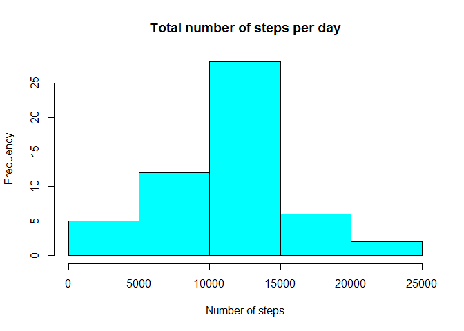
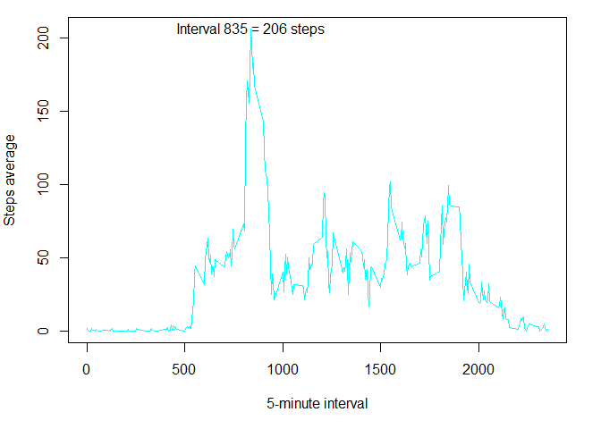
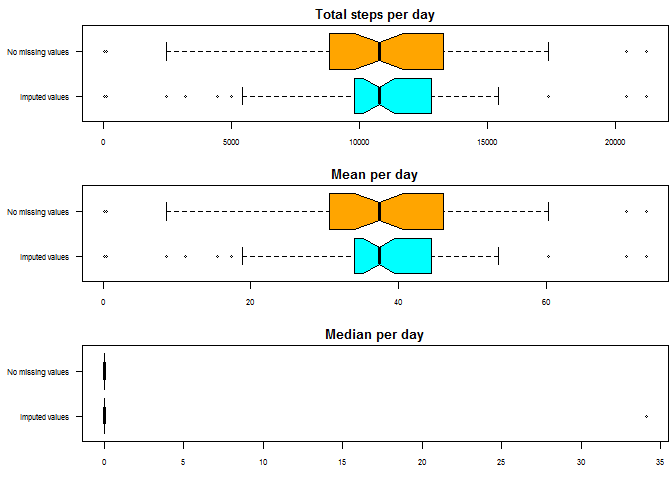
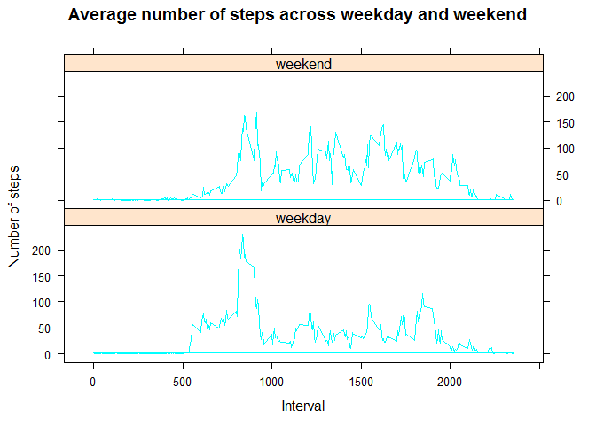

Peer Assessment 1
===================
**Antonio Martínez Pineda**

*8 de septiembre de 2015*


This is the analysis for the personal activity's dataset of the Reproducible Research Course. Data are in a comma-separated-value file (.csv) and the first action is obtaining the data, using `download.file` function we download the zipped data then `unzip` function extract the .csv and we load data into R session with `read.csv` function.

##Obtaining and transforming data


```r
urldir <- "https://d396qusza40orc.cloudfront.net/repdata%2Fdata%2Factivity.zip"
destfile <- "activity.zip"
download.file(urldir, destfile = destfile, method = "libcurl")
unzip("activity.zip")
data <- read.csv("activity.csv")
```

Now let see the data.


```r
str(data)
```

```
'data.frame':	17568 obs. of  3 variables:
 $ steps   : int  NA NA NA NA NA NA NA NA NA NA ...
 $ date    : Factor w/ 61 levels "2012-10-01","2012-10-02",..: 1 1 1 1 1 1 1 1 1 1 ...
 $ interval: int  0 5 10 15 20 25 30 35 40 45 ...
```

```r
head(data)
```

```
  steps       date interval
1    NA 2012-10-01        0
2    NA 2012-10-01        5
3    NA 2012-10-01       10
4    NA 2012-10-01       15
5    NA 2012-10-01       20
6    NA 2012-10-01       25
```

```r
tail(data)
```

```
      steps       date interval
17563    NA 2012-11-30     2330
17564    NA 2012-11-30     2335
17565    NA 2012-11-30     2340
17566    NA 2012-11-30     2345
17567    NA 2012-11-30     2350
17568    NA 2012-11-30     2355
```

```r
summary(data)
```

```
     steps                date          interval     
 Min.   :  0.00   2012-10-01:  288   Min.   :   0.0  
 1st Qu.:  0.00   2012-10-02:  288   1st Qu.: 588.8  
 Median :  0.00   2012-10-03:  288   Median :1177.5  
 Mean   : 37.38   2012-10-04:  288   Mean   :1177.5  
 3rd Qu.: 12.00   2012-10-05:  288   3rd Qu.:1766.2  
 Max.   :806.00   2012-10-06:  288   Max.   :2355.0  
 NA's   :2304     (Other)   :15840                   
```

Ok, date is a factor. I think it will be better to transform it into date object. We can do this using `ymd` function from lubridate package.


```r
library(lubridate)
data$date <- ymd(data$date)
class(data$date)
```

```
[1] "POSIXct" "POSIXt" 
```

##What is mean total number of steps taken per day?

For answer this question we gonna use the dplyr package. Firstly, we `group_by` date and eliminate NA's. Then we compute the total number, mean (rounded at two decimals) and median of steps for each day. The median is zero for all days due the huge number of each day's intervals with zero steps.


```r
library(dplyr)
stepsByday <- group_by(data[!is.na(data$steps), ], date) %>% summarise(stepsByday = sum(steps), 
    day.mean = round(mean(steps), 2), day.median = median(steps))
stepsByday
```

```
Source: local data frame [53 x 4]

         date stepsByday day.mean day.median
1  2012-10-02        126     0.44          0
2  2012-10-03      11352    39.42          0
3  2012-10-04      12116    42.07          0
4  2012-10-05      13294    46.16          0
5  2012-10-06      15420    53.54          0
6  2012-10-07      11015    38.25          0
7  2012-10-09      12811    44.48          0
8  2012-10-10       9900    34.38          0
9  2012-10-11      10304    35.78          0
10 2012-10-12      17382    60.35          0
..        ...        ...      ...        ...
```

Now the mean for total number of steps taken per day is **37.38** and the median is **0**. 

We plot a histogram for total number of steps per day:


```r
hist(stepsByday$stepsByday, col = "cyan", main = "Total number of steps per day", 
    xlab = "Number of steps")
```

 

##What is the average daily activity pattern?

Well, we continue ignoring NA's. So we compute the average of steps per 5-minute interval and plotting the time series. Using `summarise` function of dplyr packages we calculate the average for each interval.


```r
daily.pattern <- group_by(data[!is.na(data$steps), ], interval) %>% summarise(interval.ave = mean(steps))
daily.pattern
```

```
Source: local data frame [288 x 2]

   interval interval.ave
1         0    1.7169811
2         5    0.3396226
3        10    0.1320755
4        15    0.1509434
5        20    0.0754717
6        25    2.0943396
7        30    0.5283019
8        35    0.8679245
9        40    0.0000000
10       45    1.4716981
..      ...          ...
```

```r
par(mar = c(5, 4, 1, 2))
with(daily.pattern, plot(interval, interval.ave, type = "l", col = "cyan", xlab = "5-minute interval", 
    ylab = "Steps average"))
max.steps <- round(max(daily.pattern$interval.ave), 0)
max.inter <- daily.pattern[daily.pattern$interval.ave == max(daily.pattern$interval.ave), 
    ]$interval
text(max.inter + 7, max.steps, labels = paste("Interval", max.inter, "=", max.steps, 
    "steps", sep = " "))
```

 


As we can see in the time series plot the maximum average of steps corresponds to interval **835** with **206.17** steps in average across all the days in the dataset.

##Imputing missing values

###1. Number of missing values in dataset

Dataset only has missing values in *steps* variable, we can use `is.na` to compute a logical vector indicating **TRUE** where there is a missing data. With `sum` we coerced this logical vector to integer vector so **TRUE** is equal to 1L and **FALSE** is equal to 0L this give us the number of missing data (NA's = 2304).

###2. Imputing missing values

We calculate the mean of steps per interval to replace the missing values. This can be done with `summarise` function of dplyr package.


```r
impute.data <- group_by(data, interval) %>% summarise(interval.mean = mean(steps, 
    na.rm = T))
impute.data
```

```
Source: local data frame [288 x 2]

   interval interval.mean
1         0     1.7169811
2         5     0.3396226
3        10     0.1320755
4        15     0.1509434
5        20     0.0754717
6        25     2.0943396
7        30     0.5283019
8        35     0.8679245
9        40     0.0000000
10       45     1.4716981
..      ...           ...
```

###3. Create a new dataset with the replacement of missing values

Now with a loop we impute missing values for each interval with the mean of steps per interval. 


```r
noMissdata <- data
for (i in seq_along(noMissdata$interval)) {
    interval.num <- noMissdata$interval[i]
    if (is.na(noMissdata$steps[i]) == TRUE) {
        noMissdata$steps[i] <- impute.data[impute.data$interval == interval.num, 
            ]$interval.mean
    }
}
```

###4. Report total number, mean and median of steps per day, analyze if differ from previous estiamtions and make a histogram of the total number of steps per day

We repeat the summarise of *stepsByday* but with *noMissdata* data frame.


```r
noMiss.stepByday <- group_by(noMissdata, date) %>% summarise(stepsByday = sum(steps), 
    day.mean = round(mean(steps), 2), day.median = round(median(steps), 2))
noMiss.stepByday
```

```
Source: local data frame [61 x 4]

         date stepsByday day.mean day.median
1  2012-10-01   10766.19    37.38      34.11
2  2012-10-02     126.00     0.44       0.00
3  2012-10-03   11352.00    39.42       0.00
4  2012-10-04   12116.00    42.07       0.00
5  2012-10-05   13294.00    46.16       0.00
6  2012-10-06   15420.00    53.54       0.00
7  2012-10-07   11015.00    38.25       0.00
8  2012-10-08   10766.19    37.38      34.11
9  2012-10-09   12811.00    44.48       0.00
10 2012-10-10    9900.00    34.38       0.00
..        ...        ...      ...        ...
```

Because most of intervals have a different mean zero, the median for days with imputed values is quite higher.

Let see the difference of total steps, mean and median graphically.


```r
comparing <- rbind(stepsByday, noMiss.stepByday)
dataset <- factor(c(rep("No missing values", 53), rep("Imputed values", 61)))
comparing <- cbind(comparing, dataset)
par(mar = c(3, 6.5, 2, 0.3), mfrow = c(3, 1), cex.axis = 0.8)
boxplot(stepsByday ~ dataset, data = comparing, col = c("cyan", "orange"), main = "Total steps per day", 
    horizontal = T, notch = T, las = 1)
boxplot(day.mean ~ dataset, data = comparing, col = c("cyan", "orange"), main = "Mean per day", 
    horizontal = T, notch = T, las = 1)
boxplot(day.median ~ dataset, data = comparing, col = c("cyan", "orange"), main = "Median per day", 
    horizontal = T, notch = T, las = 1)
```

 

Although previous estimates present a wider variance, it seems there are no significant differences with imputed data.

##Are there differences in activity patterns between weekdays and weekends?

We use `weekdays` function to create a factor with levels "weekday" and "weekend". (as you can see my system date is in spanish)


```r
noMissdata$weekday <- weekdays(noMissdata$date)
library(car)
noMissdata$wday.wend <- recode(noMissdata$weekday, "c('lunes','martes','miércoles','jueves','viernes')='weekday';c('sábado','domingo')='weekend'", 
    as.factor.result = T, levels = c("weekday", "weekend"))
```

Now we compute average steps taken across weekday and across weekend with `mutate` function of dplyr. And plot with lattice in a timeseries.


```r
stepsByweekday <- group_by(noMissdata, interval, wday.wend) %>% mutate(weekday.mean = mean(steps, 
    na.rm = T))
stepsByweekday
```

```
Source: local data frame [17,568 x 6]
Groups: interval, wday.wend

       steps       date interval weekday wday.wend weekday.mean
1  1.7169811 2012-10-01        0   lunes   weekday   2.25115304
2  0.3396226 2012-10-01        5   lunes   weekday   0.44528302
3  0.1320755 2012-10-01       10   lunes   weekday   0.17316562
4  0.1509434 2012-10-01       15   lunes   weekday   0.19790356
5  0.0754717 2012-10-01       20   lunes   weekday   0.09895178
6  2.0943396 2012-10-01       25   lunes   weekday   1.59035639
7  0.5283019 2012-10-01       30   lunes   weekday   0.69266247
8  0.8679245 2012-10-01       35   lunes   weekday   1.13794549
9  0.0000000 2012-10-01       40   lunes   weekday   0.00000000
10 1.4716981 2012-10-01       45   lunes   weekday   1.79622642
..       ...        ...      ...     ...       ...          ...
```

```r
library(lattice)
xyplot(weekday.mean ~ interval | wday.wend, data = stepsByweekday, type = "l", 
    col = "cyan", main = "Average number of steps across weekday and weekend", 
    xlab = "Interval", ylab = "Number of steps", layout = c(1, 2))
```

 

It seems that frequency of steps on weekends is a little more consistent thru intervals than it is on weekdays.
